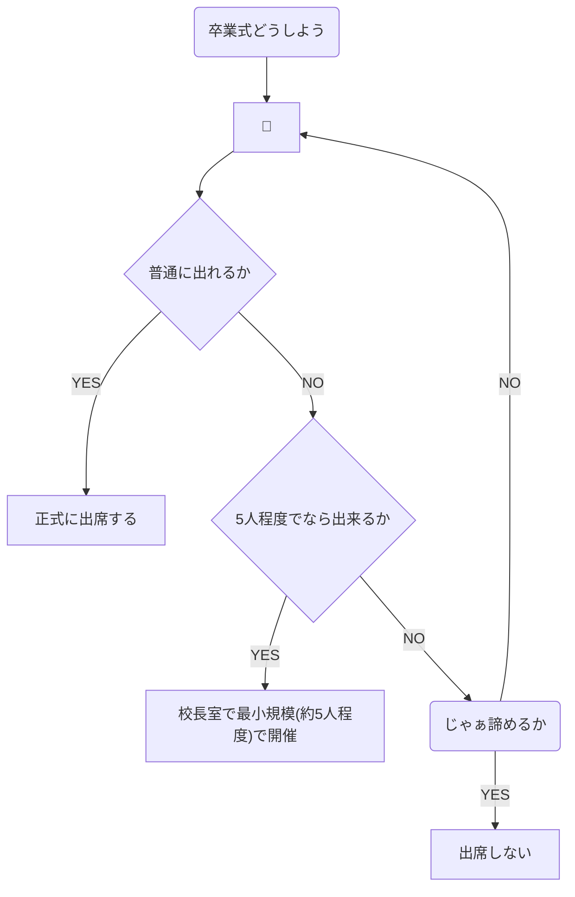

```mermaid
graph TD
    O("卒業式どうしよう") --> T["🤔"]
    T --> H
    
    H{普通に出れるか}
        H --> |YES| HY[正式に出席する]
        H --> |NO| K
    
    K{"5人程度でなら出来るか"}
        K --> |YES| KY["校長室で最小規模(約5人程度)で開催"]
        K --> |NO| E

    E(じゃぁ諦めるか)
        E --> |YES| TY[出席しない]
        E --> |NO| T
```

     
