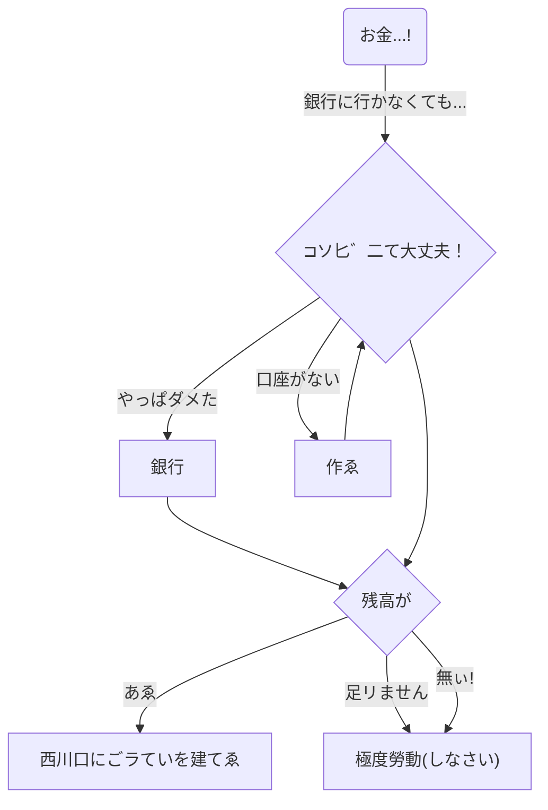

---

```
graph TD
     O("お金...!") --> |銀行に行かなくても...| C{"⊐ソ匕゛㆓て大丈夫！"}
          C --> |やっぱダメた| B[銀行]
          B --> M

          C --> |口座がない| A[作ゑ]
          A --> C

     C --> M{残高が}
          M --> |あゑ| N[西川口にごラていを建てゑ]
          M --> |足リまㄝん| D["極度勞動(しなさい)"]
          M --> |無ぃ!| D
```
